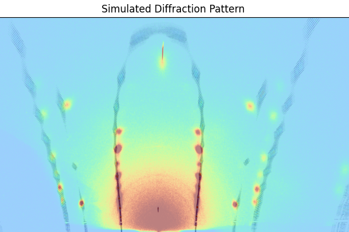
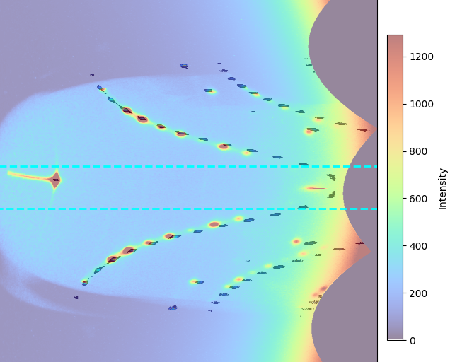
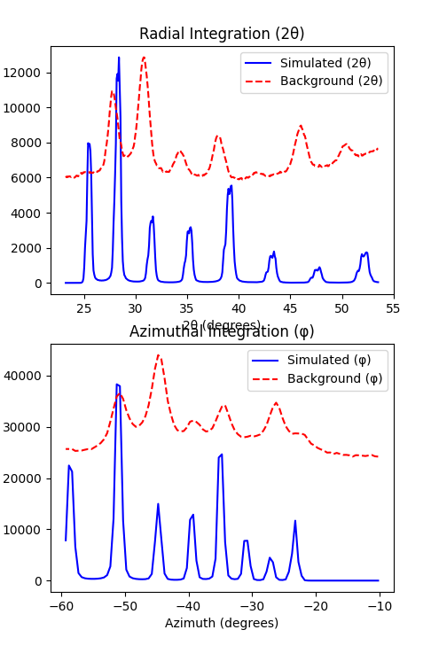
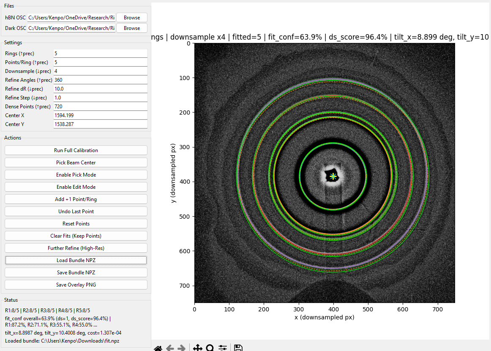
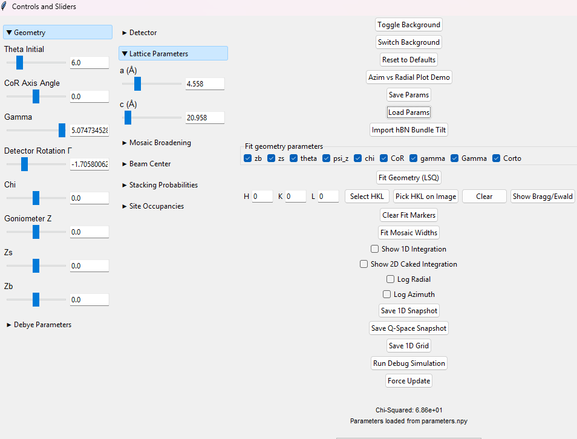

# RA Simulation

RA Simulation is an open-source Distorted-Wave Born Approximation (DWBA) forward model for quantitative analysis of diffraction from two-dimensional oriented powders. The code refines full area-detector images, jointly modeling detector geometry, mosaic orientation distributions, stacking disorder, and crystallographic structure factors. It accompanies the manuscript "Quantitative simulation and refinement of diffraction from 2D oriented powders."

## Features

- **DWBA forward model** with refraction, footprint and divergence corrections for grazing-incidence diffraction.
- **Geometry and detector calibration** using a 3D powder standard and transfer to samples.
- **Mosaic orientation distributions** parameterized by pseudo-Voigt functions for hybrid ring–cap patterns.
- **Structure-factor refinement** including fractional occupancies, atomic positions, and anisotropic Debye–Waller factors.
- **Tk-based GUI** for loading images, running simulations and refining parameters.
- **Debug utilities** and helpers for stacking-fault analysis.

## Installation

Clone the repository and install dependencies:

```bash
git clone https://github.com/<user>/ra_sim.git
cd ra_sim
pip install -e .
```

## Quick start

Launch with a startup choice prompt (calibrant fit or simulation GUI):

```bash
python -m ra_sim
# or on Windows
run_ra_sim.bat
```

Or launch a specific mode directly:

```bash
python -m ra_sim gui
python -m ra_sim calibrant
# or via main.py
python main.py
python main.py gui
python main.py calibrant
# command passthrough also works from main.py/.bat
python main.py simulate --out output.png
run_ra_sim.bat hbn-fit
```

The application loads example images specified in `config/dir_paths.yaml`. Refine detector geometry with a calibrant, then adjust mosaic and structural parameters to fit sample data. The `tests` folder contains unit tests that can be run with `pytest`.

## GUI Views (What Each One Is)

Project document: [`docs/gui_views.md`](docs/gui_views.md)

### 1) Simulation

The simulation image is the main diffraction workspace. It shows the modeled detector pattern and is the first view to use when checking whether the overall ring/cap geometry and intensity distribution match experiment.



### 2) Phi-vs-Theta and Integration

Use integration views next:

- Radial integration (`2theta`) compares intensity vs scattering angle.
- Azimuthal integration (`phi`) compares intensity vs azimuth.
- 2D caked/integration view highlights region-specific mismatch.

This stage is where you validate alignment and shape in reduced coordinates before deeper refinement.





### 3) Calibrant

Calibrant mode (hBN fitter) is for detector geometry and tilt setup from ring data. You load calibrant/dark files, fit rings, refine, and save/load NPZ bundles that feed cleaner starting geometry back into simulation.



### 4) Parameters

The parameters panel controls geometry, lattice values, mosaic broadening, beam center, stacking probabilities, occupancies, and fit toggles. It is the main control surface for iterative refinement and reproducible save/load workflows.



### Optics Transport Modes

The GUI `Optics Transport` selector provides two named modes:

- **Original Fast Approx (Fresnel + Beer-Lambert)** (`FRESNEL_CTR_DAMPING`, stored as `fast`): fast approximation that applies Fresnel interface weights with Beer-Lambert entry/exit attenuation.
- **Complex-k DWBA slab optics (Precise)** (`COMPLEX_K_DWBA_SLAB`, stored as `exact`): phase-matched complex-`k` slab refraction/transmission with the full precise transport path implemented in the simulator.

The fast mode is intentionally approximate and omits coherent internal multiple-reflection and full coherent internal phase-coupling terms. Use the precise mode when those effects matter.

### How GUI geometry fitting chooses what to match

The geometry fit button compares annotated peaks from the experimental image to simulated peaks with the **same HKL labels**. The default `config/file_paths.yaml` points `measured_peaks` at a NumPy array where each entry is either `[h, k, l, x_pix, y_pix]` or a dict with `{"label": "h,k,l", "x": ..., "y": ...}`. During fitting, RA-Sim:

1. Rotates those measured coordinates to match the displayed background.
2. Runs a full simulation with the current geometry and finds each simulated peak’s maximum pixel position for every HKL in `miller`.
3. For each HKL present in both measured and simulated data, converts the pixel coordinates to (2θ, φ) angles, sorts them radially, and pairs them in order.
4. Minimizes the angular residuals (Δ2θ, Δφ) between each measured/simulated pair for the selected geometry parameters.

This pairing enforces HKL correspondence: the optimizer only adjusts geometry so that a given experimental peak lines up with the simulated location of the **same reflection**, not just any nearby bright spot.

## Command-line hBN ellipse fitting

You can run the hBN ellipse fitting workflow without the GUI through the project CLI. The workflow understands a YAML/JSON paths file so you do not have to repeat calibrant and dark frame paths each time.

1. Update `config/hbn_paths.yaml` with your calibrant, dark, and optional bundle/profile paths (or point `--paths-file` to a custom YAML/JSON).
2. Launch the workflow at full 3000×3000 resolution from the command prompt:

```bash
# Use the default config/hbn_paths.yaml and process at full resolution
python -m ra_sim hbn-fit

# Load the bundle listed in the paths file without retyping its path
python -m ra_sim hbn-fit --load-bundle

# Recompute a fresh background/fit at full resolution using stored ellipses as starting guesses
python -m ra_sim hbn-fit --load-bundle --highres-refine --osc /path/to/calibrant.osc --dark /path/to/dark.osc

# Collect a fresh set of 5 points on each of the 5 rings even when a bundle exists
python -m ra_sim hbn-fit --reclick --osc /path/to/calibrant.osc --dark /path/to/dark.osc

# Supply an alternate paths file
python -m ra_sim hbn-fit --paths-file /path/to/custom_hbn_paths.yaml
```

When a bundle NPZ is provided in the paths file (or via `--load-bundle`), `--highres-refine` will rebuild the background and refit using the saved ellipses as starting guesses at full resolution.

**Why five clicks per ring?** An unconstrained ellipse has five free parameters (center `xc, yc`, semi-axes `a, b`, and rotation `θ`), so you need at least five non-collinear points to uniquely define it. If you click fewer than five points the fit becomes underdetermined; the workflow therefore requires five points unless you are reusing a saved click profile or bundle that already contains the necessary geometry.

After each run, the overlay figure shows the fitted ellipses on top of the background-subtracted image and annotates the fitted parameters (xc, yc, a, b, θ). The saved fit profile also records an estimated detector tilt; the GUI and the `simulate` CLI subcommand will use this tilt as their starting Rot1/Rot2 defaults the next time you launch a simulation.

## Troubleshooting

Set `RA_SIM_DEBUG=1` to enable verbose logging and additional diagnostic plots:

```bash
export RA_SIM_DEBUG=1  # Linux/macOS
# or
set RA_SIM_DEBUG=1     # Windows CMD
```

## Citation

If you use this software in published work, please cite the corresponding paper:

> D. V. Beckwitt *et al.*, "Quantitative simulation and refinement of diffraction from 2D oriented powders," (in preparation, 2024).

## License

This project is distributed under the terms of the GNU General Public License v3.0. See [LICENSE](LICENSE) for details.

