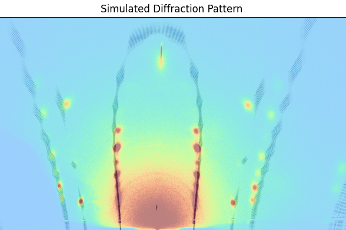
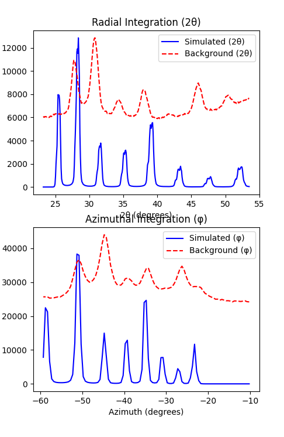
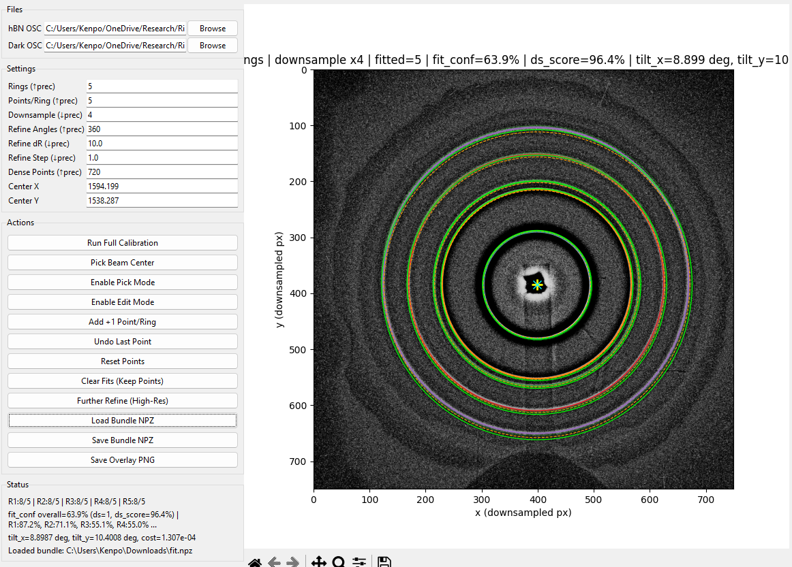
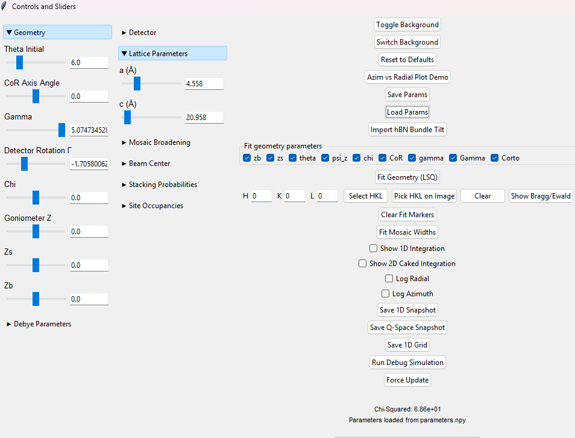

<div align="center">
  <h1>RA-SIM</h1>
  <p><strong>DWBA forward simulation and refinement for 2D oriented powder diffraction</strong></p>
  <p>
    RA-SIM is research software for modeling grazing-incidence diffraction on area
    detectors, calibrating detector geometry, and refining mosaic, stacking-disorder,
    and crystallographic parameters against experimental images.
  </p>
  <p>
    <a href="https://github.com/DVBeckwitt/ra_sim/actions/workflows/ci.yml">
      
    </a>
    <a href="https://www.python.org/downloads/">
      
    </a>
    <a href="LICENSE">
      
    </a>
  </p>
  <p>
    <a href="#installation">Installation</a> •
    <a href="#configuration">Configuration</a> •
    <a href="#usage">Usage</a> •
    <a href="#screenshots">Screenshots</a> •
    <a href="#development">Development</a>
  </p>
</div>



> [!NOTE]
> RA-SIM is active research software. The repository does not bundle raw detector
> data, so you will need to point the configuration files at local `.osc`, `.poni`,
> `.cif`, and measured-peak inputs before launching the workflows.

## Highlights

- Full 2D grazing-incidence forward modeling with refraction, footprint,
  divergence, detector geometry handling, and a switch between the original fast
  optics approximation and a more exact complex-k DWBA slab transport model.
- Calibration workflow for fitting hBN ring ellipses and transferring detector
  geometry into simulation runs.
- Refinement controls for mosaic orientation distributions, stacking disorder,
  lattice parameters, occupancies, and Debye-Waller terms.
- Geometry-fit-cached detector-shape mosaic fitting in the main GUI so mosaic
  broadening can be refined against the same anchored detector features used for
  geometry fitting.
- Desktop GUI for image-based analysis plus CLI entry points for headless
  simulation and calibrant fitting.

## Installation

RA-SIM supports Python 3.11+.

```bash
git clone https://github.com/DVBeckwitt/ra_sim.git
cd ra_sim
python -m pip install -e .
```

If you prefer the installed console script, the package also exposes `ra-sim`.

The base install pulls in the supported Python-side dependencies for the main
GUI, calibrant workflow, headless simulation tools, and the packaged mosaic
launcher automatically.

The install includes a pinned `mosaic_sim` dependency sourced from
[`DVBeckwitt/2D_Mosaic_Sim`](https://github.com/DVBeckwitt/2D_Mosaic_Sim), so
`python -m ra_sim mosaic` launches the installed visualizer directly.

For local development and CI-equivalent tooling, install the `dev` extra:

```bash
python -m pip install -e ".[dev]"
```

> [!TIP]
> The GUI uses Tkinter. Windows and macOS Python distributions usually include
> it already, but some Linux environments require installing the system Tk
> package separately, often as `python3-tk` or `python3.11-tk`.

> [!TIP]
> If a fresh install can run headless commands but `python -m ra_sim gui` or
> `python -m ra_sim calibrant` reports that Tkinter is unavailable, the fix is
> usually that missing Linux system package rather than another pip package.

> [!NOTE]
> The optional fast-viewer acceleration path is not installed by default. It
> still requires a separate Qt binding plus `pyqtgraph`.

## Configuration

RA-SIM reads project settings from `config/`.

1. Create local machine-specific path files from the examples.
2. Update the file so it points at your experiment-specific data.
3. Optionally move your config out of the repository and set `RA_SIM_CONFIG_DIR`
   to that folder.

```bash
cp config/file_paths.example.yaml config/file_paths.yaml
cp config/hbn_paths.example.yaml config/hbn_paths.yaml
# Windows PowerShell: Copy-Item config/file_paths.example.yaml config/file_paths.yaml
# Windows PowerShell: Copy-Item config/hbn_paths.example.yaml config/hbn_paths.yaml
```

The local override files `config/file_paths.yaml` and `config/hbn_paths.yaml`
are intended to stay untracked. The repository keeps only example templates so
machine-specific paths, downloads, and local experiment bundles do not get
committed accidentally.

At minimum, review these files:

- `config/file_paths.yaml` for detector images, `.poni` geometry, CIF input,
  measured peaks, and output artifacts.
- `config/hbn_paths.yaml` for the headless hBN ellipse-fit workflow.
- `config/instrument.yaml` and `config/materials.yaml` for instrument defaults
  and material-specific constants.

## Usage

Common entry points:

| Task | Command |
| --- | --- |
| Interactive launcher | `python -m ra_sim` |
| Main GUI | `python -m ra_sim gui` |
| Windows launcher | `run_ra_sim.bat` |
| Calibrant GUI | `python -m ra_sim calibrant` |
| 2D mosaic visualizer | `python -m ra_sim mosaic` |
| Headless simulation | `python -m ra_sim simulate --out output.png` |
| Headless hBN ellipse fit | `python -m ra_sim hbn-fit` |

The mosaic launcher uses the installed `mosaic_sim` package that ships as a
hard dependency of RA-SIM. No sibling checkout or extra repository override is
required.

A typical workflow looks like this:

1. Fit detector geometry with the calibrant workflow.
2. Launch the main GUI and load your experimental background.
3. Match 2D detector features first, then validate radial and azimuthal
   integrations.
4. Refine mosaic, stacking, and structural parameters and save parameter
   snapshots for reproducibility.

### Primary 2D Viewport

The default main detector/caked viewport now uses the Tk-native canvas renderer.
Set `RA_SIM_PRIMARY_VIEWPORT=matplotlib` to force the legacy embedded
Matplotlib surface.

The justification is specific to the main detector/caked image, not to plotting
in general. Matplotlib is the better tool for full plotting workflows with
axes, colorbars, figure layout, export, and the 1D analysis views used
throughout RA-SIM. The primary diffraction image, however, behaves more like an
interactive image viewport than a conventional plot: users pan, zoom, drag
integration ranges, and click simulated features at high frequency. In that
path, Matplotlib pays for its general artist and figure machinery on every
interaction-driven redraw. A Tk `Canvas` can instead update one raster image
plus lightweight overlay items directly, which reduces latency for detector and
caked interactions while keeping the existing selection logic intact. The
Matplotlib path remains the explicit fallback and is still the reference backend
for figure-heavy tools.

### Optics Modes

RA-SIM currently exposes two optics-transport models in the GUI and headless
paths:

- `Original Fast Approx (Fresnel + Beer-Lambert)` uses a grazing-angle
  transmitted-angle approximation, Fresnel transmission factors, and
  exponential depth attenuation. Exit optics are cached in a lookup table, so
  this mode is much faster and is the default for interactive fitting.
- `Complex-k DWBA slab optics (Precise)` keeps the same reflection list,
  `solve_q` search, structure factors, and detector projection, but replaces
  the entry and exit transport with a complex-`k_z` slab treatment. It computes
  the in-sample and exit wavevectors from the slab dispersion relation and uses
  exact Fresnel power transmission at the air/sample interfaces.

In other words, the "DWBA" difference here is mainly in how the beam is
refracted, transmitted, and attenuated on the way into and out of the sample.
It is not a separate detector model or a different structure-factor engine.

Detector placement now uses the solved outgoing direction itself rather than a
refracted exit angle. The older fast-projection path solved an in-sample
outgoing angle `2theta_t'`, remapped it to `2theta_t = arccos(n_real cos
2theta_t') sign(2theta_t')`, and then intersected the detector with that
remapped ray. Because `n_real < 1` for x-rays, that remap imposed a minimum
projected angle near the critical angle `alpha_c = arccos(n_real)`, creating a
forbidden strip around the sample plane and the moving horizontal empty line
seen in some backgrounds. The current path keeps Fresnel transmission,
attenuation, and related optics weights in the intensity, but uses the
normalized solved outgoing vector for detector geometry.

The current exact path is an air/sample/air slab model rather than a general
multilayer stack. Use the fast mode when you need throughput, and the exact
mode when refraction and near-critical-angle transport matter more than speed.

### Manual Geometry Fit

The GUI manual geometry-fit path uses one objective throughout the solve.

- Manual picks keep a detector-native background anchor plus the chosen
  simulated source identity.
- Saved/manual geometry-fit runs rebuild missing source rows automatically from
  the live runtime cache, the last retained or logged intersection cache, or a
  fresh simulation before failing.
- Source identity stays pinned to the saved source row or peak when that key is
  still valid, then falls back through q-group or HKL-based rebinding if the
  reflection ordering changed.
- During refinement the solver recomputes both the observed and simulated points
  in the same detector-derived angular space, using residuals in `(2theta, phi)`.
- Geometry, lattice, wavelength, and shared-theta updates now re-anchor both the
  simulated source rows and the measured/background peak maxima during the solve
  until they converge.
- Detector-geometry variables move both sides of the comparison; shared
  sample-rotation variables only move the simulated side.
- The GUI disables rematching, robust weighting, and post-polish stages for
  this path so the solve stays on the manual correspondence workflow while still
  refreshing those anchors as the underlying geometry changes.

Reference:

- [RA-SIM reference](docs/simulation_and_fitting.md)
- [GUI workflow and views](docs/simulation_and_fitting.md#gui-workflow-and-views)
- [Center of rotation axis math](docs/simulation_and_fitting.md#appendix-a-center-of-rotation-axis-math)
- [Logging, debug, and cache controls](docs/simulation_and_fitting.md#logging-debug-and-cache-controls)

<details>
<summary>Advanced CLI examples</summary>

```bash
# Launch the GUI through the installed script
ra-sim gui

# Save a headless simulation image
python -m ra_sim simulate --out output.png --samples 2000 --image-size 3000

# Use the default hBN paths file
python -m ra_sim hbn-fit --load-bundle

# Use a custom hBN paths file
python -m ra_sim hbn-fit --paths-file /path/to/custom_hbn_paths.yaml

# Refit the hBN workflow at full resolution
python -m ra_sim hbn-fit --load-bundle --highres-refine
```

</details>

## Screenshots

<table>
  <tr>
    <td align="center" width="50%">
      <br />
      <strong>Simulation</strong><br />
      Main diffraction workspace for matching detector-space features.
    </td>
    <td align="center" width="50%">
      <br />
      <strong>Integration</strong><br />
      Reduced-coordinate views for radial and azimuthal comparisons.
    </td>
  </tr>
  <tr>
    <td align="center" width="50%">
      <br />
      <strong>Calibrant</strong><br />
      Ring fitting and geometry transfer from hBN calibrant data.
    </td>
    <td align="center" width="50%">
      <br />
      <strong>Parameters</strong><br />
      Central control surface for geometry, mosaic, beam, and structure refinement.
    </td>
  </tr>
</table>

## Project Layout

- `ra_sim/` contains the core simulation, fitting, GUI, and CLI code.
- `config/` contains default instrument, material, and path configuration files.
- `docs/` contains GUI notes, figures, and supporting technical writeups.
- `tests/` contains regression tests for the simulation, fitting, GUI helpers,
  and CLI behavior.

## Development

The CI workflow runs on Python 3.11 through 3.13. Install the dev extra, then run:

```bash
python -m pip install -e ".[dev]"
```

Local checks:

```bash
ruff check .
pytest -q
python -m mypy ra_sim/config ra_sim/simulation ra_sim/fitting ra_sim/gui
```

Set `RA_SIM_DEBUG=1` to enable verbose debug output and extra diagnostics.

Security/governance automation:

- Dependabot updates Python dependencies and GitHub Actions weekly.
- The security workflow scans for committed secrets, vulnerable Python packages,
  and tracked machine-local paths before merge.

## Citation

If RA-SIM contributes to published work, please cite the accompanying manuscript:

> D. V. Beckwitt *et al.*, "Quantitative simulation and refinement of diffraction from 2D oriented powders," (in preparation, 2024).

## License

RA-SIM is distributed under the GNU General Public License v3.0. See
[LICENSE](LICENSE) for details.
