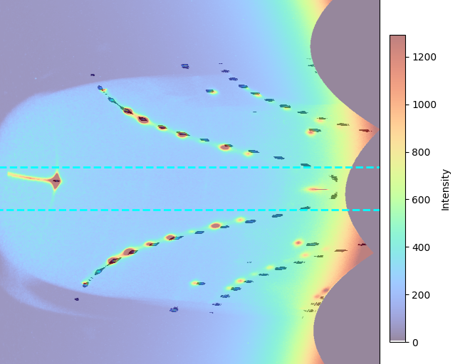

# RA Simulation

RA Simulation is an open-source Distorted-Wave Born Approximation (DWBA) forward model for quantitative analysis of diffraction from two-dimensional oriented powders. It refines full area-detector images by jointly modeling detector geometry, mosaic orientation distributions, stacking disorder, and crystallographic structure factors. It accompanies the manuscript "Quantitative simulation and refinement of diffraction from 2D oriented powders."

## GUI Screenshots





## Features

- **DWBA forward model** with refraction, footprint, and divergence corrections for grazing-incidence diffraction.
- **Geometry and detector calibration** using a 3D powder standard and transfer to samples.
- **Mosaic orientation distributions** parameterized by pseudo-Voigt functions for hybrid ring-cap patterns.
- **Structure-factor refinement** including fractional occupancies, atomic positions, and anisotropic Debye-Waller factors.
- **Tk-based GUI** for loading images, running simulations, and refining parameters.
- **Debug utilities** and helpers for stacking-fault analysis.

## Installation

Clone the repository and install dependencies:

```bash
git clone https://github.com/<user>/ra_sim.git
cd ra_sim
pip install -e .
```

## Quick start

Launch with a startup prompt (calibrant fit or simulation GUI):

```bash
python -m ra_sim
# or on Windows
run_ra_sim.bat
```

Launch a specific mode directly:

```bash
python -m ra_sim gui
python -m ra_sim calibrant

# or via main.py
python main.py
python main.py gui
python main.py calibrant

# command passthrough also works from main.py/.bat
python main.py simulate --out output.png
run_ra_sim.bat hbn-fit
```

The application loads example images specified in `config/dir_paths.yaml`. A typical workflow is: refine detector geometry with a calibrant, then adjust mosaic and structural parameters to fit sample data. Unit tests live in `tests` and run with `pytest`.

## GUI Views (What Each One Is)

Project document: [`docs/gui_views.md`](docs/gui_views.md)

### 1) Simulation

The simulation image is the main diffraction workspace. It shows the modeled detector pattern and is the first view to use when checking whether the overall ring or cap geometry and the coarse intensity distribution match experiment.


### 2) Phi-vs-Theta and Integration

Use the integration views next:

- Radial integration (`2theta`) compares intensity versus scattering angle.
- Azimuthal integration (`phi`) compares intensity versus azimuth.
- 2D caked (integration) view highlights region-specific mismatch.

This stage validates alignment and shape in reduced coordinates before deeper refinement.


### 3) Calibrant

Calibrant mode (hBN fitter) sets detector geometry and tilt from ring data. Load calibrant and dark files, fit rings, refine, then save or load NPZ bundles that feed clean starting geometry back into simulation.


### 4) Parameters

The parameters panel controls geometry, lattice values, mosaic broadening, beam center, stacking probabilities, occupancies, and fit toggles. It is the main control surface for iterative refinement and reproducible save and load workflows.


## Optics Transport Modes

The GUI `Optics Transport` selector provides two named modes:

- **Original Fast Approx (Fresnel + Beer-Lambert)** (`FRESNEL_CTR_DAMPING`, stored as `fast`): applies Fresnel interface weights with Beer-Lambert entry and exit attenuation.
- **Complex-k DWBA slab optics (Precise)** (`COMPLEX_K_DWBA_SLAB`, stored as `exact`): phase-matched complex-k slab refraction and transmission with the full transport path implemented in the simulator.

The fast mode is intentionally approximate and omits coherent internal multiple-reflection and full coherent internal phase-coupling terms. Use the precise mode when those effects matter.

## How GUI geometry fitting chooses what to match

The geometry fit compares annotated peaks from the experimental image to simulated peaks with the same HKL labels. The default `config/file_paths.yaml` points `measured_peaks` at a NumPy array where each entry is either `[h, k, l, x_pix, y_pix]` or a dict like `{"label": "h,k,l", "x": ..., "y": ...}`. During fitting, RA-Sim:

1. Rotates measured coordinates to match the displayed background.
2. Runs a full simulation with the current geometry and finds each simulated peak’s maximum pixel position for every HKL in `miller`.
3. For each HKL present in both measured and simulated data, converts pixel coordinates to `(2theta, phi)`, sorts radially, and pairs in order.
4. Minimizes angular residuals `(Δ2theta, Δphi)` between measured and simulated pairs for the selected geometry parameters.

This pairing enforces HKL correspondence. The optimizer aligns each experimental reflection to the simulated location of the same reflection, not just a nearby bright spot.

## Command-line hBN ellipse fitting

You can run the hBN ellipse fitting workflow without the GUI through the project CLI. The workflow accepts a YAML or JSON paths file so you do not have to retype calibrant and dark paths each run.

1. Update `config/hbn_paths.yaml` with calibrant, dark, and optional bundle or profile paths (or point `--paths-file` to a custom YAML or JSON).
2. Launch at full 3000×3000 resolution:

```bash
# Use the default config/hbn_paths.yaml and process at full resolution
python -m ra_sim hbn-fit

# Load the bundle listed in the paths file without retyping its path
python -m ra_sim hbn-fit --load-bundle

# Recompute a fresh background and refit at full resolution using stored ellipses as starting guesses
python -m ra_sim hbn-fit --load-bundle --highres-refine --osc /path/to/calibrant.osc --dark /path/to/dark.osc

# Collect a fresh set of 5 points on each of the 5 rings even when a bundle exists
python -m ra_sim hbn-fit --reclick --osc /path/to/calibrant.osc --dark /path/to/dark.osc

# Supply an alternate paths file
python -m ra_sim hbn-fit --paths-file /path/to/custom_hbn_paths.yaml
```

When a bundle NPZ is provided in the paths file (or via `--load-bundle`), `--highres-refine` rebuilds the background and refits using the saved ellipses as starting guesses at full resolution.

**Why five clicks per ring?** An unconstrained ellipse has five free parameters (center `xc, yc`, semi-axes `a, b`, and rotation `theta`). You need at least five non-collinear points to uniquely define it. Fewer points underdetermine the fit, so the workflow requires five unless you reuse a saved click profile or bundle that already contains the needed geometry.

After each run, the overlay figure shows fitted ellipses over the background-subtracted image and annotates `(xc, yc, a, b, theta)`. The saved fit profile also records an estimated detector tilt. The GUI and the `simulate` CLI subcommand use this tilt as starting `Rot1` and `Rot2` defaults for the next simulation.

## Troubleshooting

Set `RA_SIM_DEBUG=1` for verbose logging and extra diagnostic plots:

```bash
export RA_SIM_DEBUG=1  # Linux/macOS
# or
set RA_SIM_DEBUG=1     # Windows CMD
```

## Limitations

A common critique is that some datasets demand fully dynamical diffraction or more complete internal multiple-reflection physics than a practical DWBA workflow provides. The practical rebuttal is that RA Simulation exposes a precise slab-transport option and supports end-to-end refinement against full detector images, which often makes the dominant systematic errors visible and reducible in the fit.

## Citation

If you use this software in published work, please cite the corresponding paper:

> D. V. Beckwitt *et al.*, "Quantitative simulation and refinement of diffraction from 2D oriented powders," (in preparation, 2024).

## License

This project is distributed under the terms of the GNU General Public License v3.0. See [LICENSE](LICENSE) for details.
